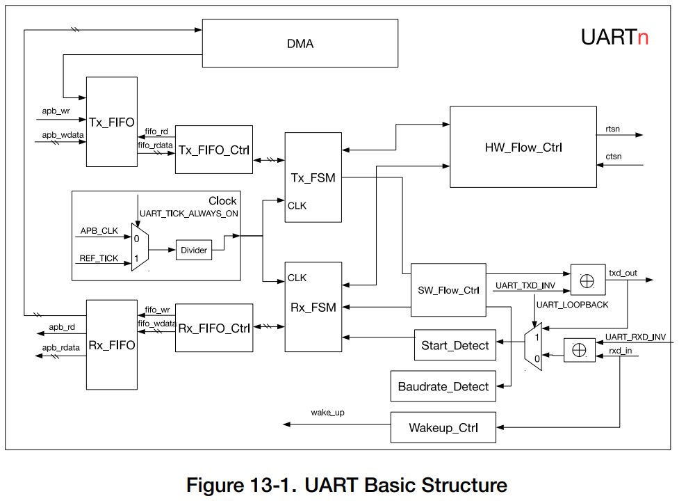

# Universal Asynchronous Receiver Transmitter Controller (UART)

## Overview
The 3 UART controllers available on a chip UARTn, where n = 0, 1, and 2.

## UART Features
- Programmable baud rate
- 1024 × 8-bit RAM shared by three UART **transmit-FIFOs** and **receive-FIFOs**
- Supports input baud rate self-check
- Supports 5/6/7/8 bits of data length
- Supports 1/1.5/2/3 STOP bits
- Supports parity bit
- Supports RS485 Protocol
- Supports IrDA Protocol
- Supports **DMA** to communicate data in high speed
- Supports UART wake-up
- Supports both software and hardware flow control

# Functional Description
## Introduction

## UART Architecture
Figure below shows the basic block diagram of the UART controller

 

Clock:
- Clock sources: the 80-MHz **APB_CLK**, or the reference clock **REF_TICK**
- Configure clock source: **UART_TICK_REF_ALWAYS_ON**
- A divider has the clock divider value in **UART_CLKDIV_REG** = UART_CLKDIV (integral part) + UART_CLKDIV_FRAG (decimal part)

The UART controller can be further broken down into two functional blocks — the transmit block and the receive block.

**The Transmit block**:
- A Transmit-FIFO buffer: buffers data awatting to be transmitted.
- Software can write Tx_FIFO via the advanced peripheral bus (APB), and transmit data into Tx_FIFO via DMA.
- **Tx_FIFO_Ctrl** is used to control read- and write- access to the Tx_FIFO.
- UART_TXD_INV...

**The Receive block**:
- A Receive-FIFO buffer: buffers incoming data awaiting to be processed.
- Baudrate_Detect: measures the baud rate of the input signal by measuring the minimum pulse width of the input bit stream.
- Start_Detect: is used to detect a START bit in a frame of incoming data.
- After detecting the START bit in rxd_in, RX_FSM stores data retrieved from the received frame into Rx_FIFO through Rx_FIFO_Ctrl.
- Software can read data in the Rx_FIFO through the APB or the DMA can be configured for sending or receiving data.
- UART_RXD_INV...
- 

__HW_Flow_Ctrl__: Control the data flow of rxd_in and txd_out through standard UART RTS and CTS flow control signals (rtsn_out and ctsn_in).

__SW_Flow_Ctrl__: controls the data flow by inserting special characters in the incoming and outgoing data flow.

__Wakeup_Ctrl__: 
- When UART is in Light-sleep mode, Wakeup_Ctrl will start counting pulses in rxd_in.
- When the number or positive edges of RxD signal is greater than or equal to (`UART_ACTIVE_THRESHOLD`+2), a wake_up signal will be generated and sent to RTC. RTC will then wake up the UART controller.
- `Note` that only UART1 and UART2 support Light-sleep mode and that rxd_in cannot be input through GPIO Matrix but only through IO_MUX.

## UART RAM

 

3 UART controllers share a 1024 × 8-bit RAM space:
- RAM is allocated in different blocks: `One` block holds 128 × 8-bit data.
- Tx_FIFO of UARTn can be extended by setting UARTn_TX_SIZE, while Rx_FIFO of UARTn can be extended by setting UARTn_RX_SIZE.
- __NOTICE__: Extending the FIFO space of a UART controller may take up the FIFO space of another UART controller.

